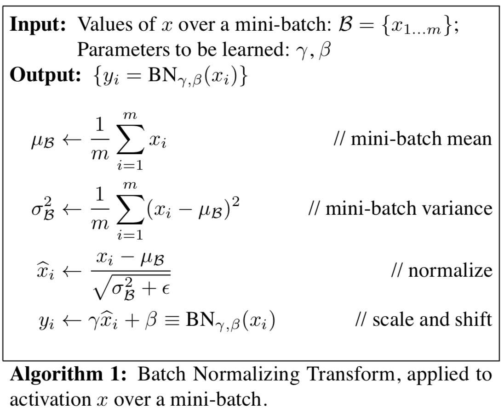
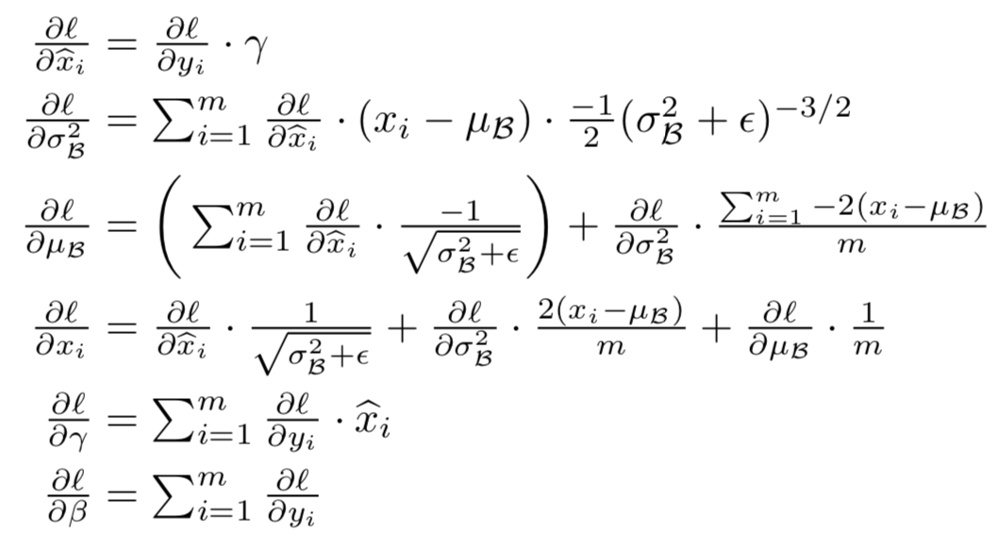
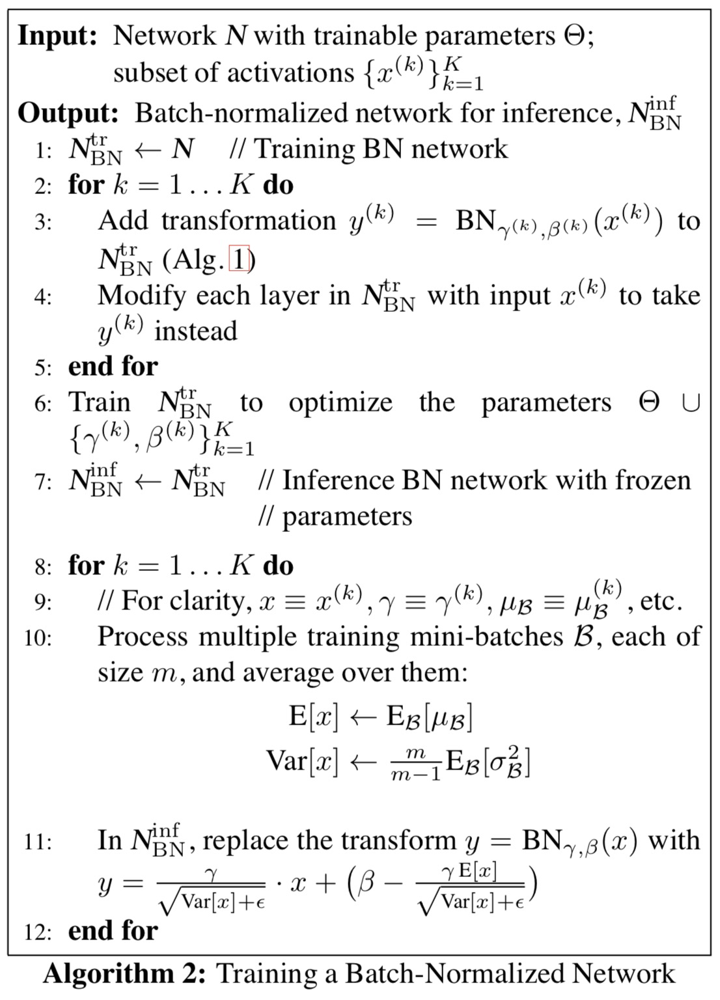

# Paper Name:
**_Batch Normalization: Accelerating Deep Network Training by Reducing Internal Covariate Shift_**
# publishing information
S. Ioffe and C. Szegedy. Batch normalization: Accelerating deep
network training by reducing internal covariate shift. In ICML, 2015. [[paper]](https://arxiv.org/abs/1502.03167)
# 1. background problem:
  * the distribution of each layer's inputs changes during training, as the parameters of the previous layers change.
  
  * the training is complicated by the fact that the inputs to each layer are affected by the parameters of all proceeding layers, so that small changes to the network parameters amplify as the network becomes deeper.

  * whiten has several disadvantages.
  * previous approaches change the representation ability of a network by discarding the absolute scale of activations.
  
# 2. the proposed methods:
  * propose a new mechanism, which called Batch Normalization, that takes a step towards reducing internal covariate shift. 

# 3. dataset:
  * `MNIST` input: 28\*28\*1. and three fully-connected hidden layers with 100 activations each followed by a sigmoid function. Last hidden layer is followed by a fully-connected layer with 10 activations and cross-entropy loss.
  * `LSVRC2012` training as the GoogLeNet, except apply BN to the input of each nonlinearity, in a convolutional way.  
    |Model          | steps to 72.2%|  Max accuracy| 
    |-------------  |:--------------:| ------------:| 
    |Inception      |   31.0*10^6   |  72.2%        | 
    |BN-Baseline    |   13.3.0*10^6 |  72.7%        | 
    |BN-x5          |   2.1*10^6    |  73.0%        | 
    |BN-x30         |   2.7*10^6    |  74.8%        | 
    |BN-x5-Sigmoid  |               |  69.8%        |
    
    
# 4. advantages:
  * dramatically accelerates the training of deep neural nets
  * has a beneficial effect on the gradient flow through the network through the network, by reducing the dependence of gradients on the scale of parameters or their initial values.
  * allow us to use much higher learning rates without the risk of divergence.
  * it regularizes the model and reduces the need for Dropout.
  * and BN can also make it possible to use saturating nonlinearities such as Sigmoid by preventing the network from getting stuck in the saturated modes.
  * when apply it to the GoogLeNet, show that match its performance using only 7% of the training steps, and can further exceed its accuracy by a substantial margin (train **_faster_** and achieve **_higher accuracy_** )
  * the learned affine transform applied to these normalized activations allows the BN transform to represent the identity transformation and preserves the network **_capacity_**.

# 5. the detail of methods:
  * why not whiten?
    * whitening the input indeed can help the network training converges faster, and take a step towards achieving the fixed distributions of inputs that can remove the ill effects of the internal covariant shift.
    * whitening the layer inputs is expensive, as it requires computing the covariance matrix and its inverse square root, to produce the whitened activations 
    
    * whitening process changes the distribution of each layer, thus changing the ability of express its own data, and ultimately losing the learned information.

  * the original of Batch Normalization
    * first simplification: normalize each scalar feature independently, by making it have the mean of zero and the variance of one. Namely, normalize each dimension: 
    $$ \hat{x}^{(k)} = \frac{x^{(k)} - E\left [x^{(k)}  \right ] }{\sqrt{Var\left [ x^{(k)} \right ]}}$$

    * simply normalizing may change what the layer can represent. To address this, we make sure the **transformation inserted in the network can represent the identity transform**, then introduce a pair of parameters $ \gamma^{(k)} $ and $ \beta^{(k)}$, which scale and shift the normalized value:  
    $$ y^{k} = \gamma^{(k)} * \hat{x}^{(k)} + \beta^{(k)} $$
    
    * second simplification: since we use mini-batch in stochastic gradient learning, **each mini-batch produces estimates of the mean and variance of each activation**
  * the Batch Normalization Transform 
    *  $ \beta $ is a mini-batch of m, $x $ have k dimension and omit $ k $ for clarity, $ \epsilon $ is a small constant for numerical stability.
    * $ \gamma、\beta $ depends both on the training example and **the other examples in the mini-batch**
    * and to conv layer, use the effective mini-batch of size m' = | $\beta$| = m * p * q, and learn a pair of parameters $\gamma^{(k)} $ and $\beta^{(k)}$ `per feature map`

        
  * the backpropagate of Batch Normalization:
    use chain rule, as follows: 
        
  
  * procedure of training batch-normalized networks: 
    

 
  * approaches for accelerating BN network:
    * `increase learning rate`
    * remove dropout, or reduce the percentage of it 
    * reduce the L2 weight regularization
    * accelerate the learning rate decay.
    * remove Local Response Normalization.
    * `shuffle training example more throughly`.
    * reduce the photometric distortions.

# 6. contribution:
  * Batch normalization optimizes network training.
# 7. any questions during the reading :
  * what is the **_internal convariate shift_** 
  answer: it is the change in the distribution of network activations due to the change in network parameters during training.

# 8. vocabulary:
notoriously hard 出了名
exceed 超过
proceed 继续
oppose 反对
preceding 前面
notion 概念
notation 记号
arithmetic 算数
regime 政权
substantial 坚实的
interval 间隔
interspersed 穿插
whitened 白化
subsequent 随后
consequence 结果
scale 规模、比例
scalar 标量
empirically 经验
stand-alone 独立
account for 考虑
omit 忽略
crucial 重要的
inference 推理
subsumed 归入
resilient 弹性
consecutive 连续
precise 
previous
precious
evolution 演化
held-out 保持
distortion
premise 前提
over the course of 整个过程中
