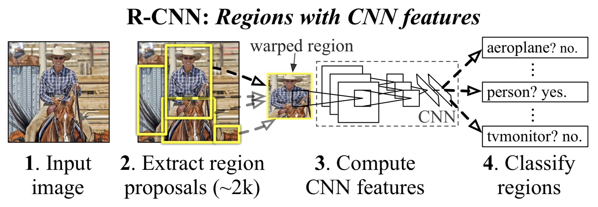
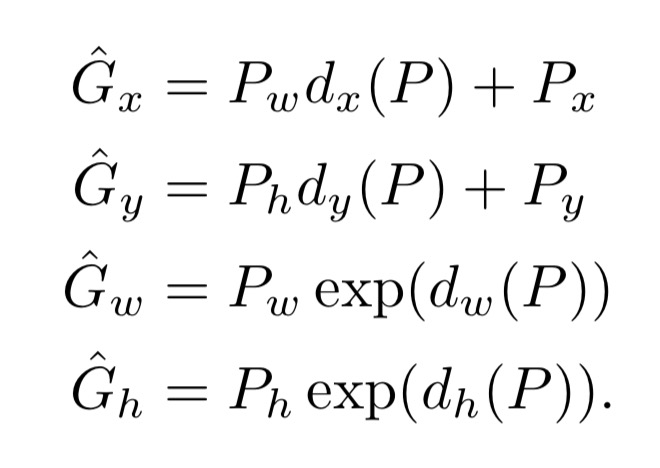
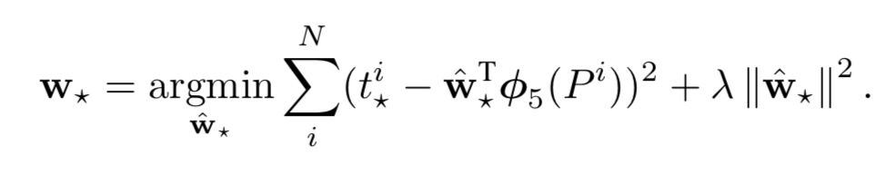
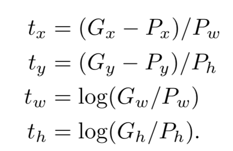

# Paper Name:
**_Rich feacture hierarchies for accurate object detection and semantic segmentation_**

# publishing information
R. Girshick, J. Donahue, T. Darrell, and J. Malik. Rich feature hierarchies for accurate object detection
and semantic segmentation. In CVPR, 2014.
[[paper]](https://www.cv-foundation.org/openaccess/content_cvpr_2014/html/Girshick_Rich_Feature_Hierarchies_2014_CVPR_paper.html)

# 1. background problem:
  * the progress on various visual recognition tasks has been based on the use of SIFT and HOG, and then the performance has plateaued in last years.
  * there is only a small quantity of annotated detection data.
  * AlexNet show a substantially higher image classification accuracy on the ILSVRC by training a larger CNN on 1.2 million labels images, with ReLU and dropout regularization.

# 2. the proposed methods:
  * one can apply high-capacity convolutional neural networks to bottom-up region proposals in order to localize and segment object.
  * and when labeled training data is scarce, superivsed pre-training for an auxiliary task, followd by domain-specific fine-tuning, yields a significant performance boost.

# 3. dataset:
  * PASCAL VOC 2007 mAP 58.5% using AlexNet, and 66% using VGGNet, but the compute time in VGGNet is 7 times longer than AlexNet.
  * PASCAL VOC 2010 mAP 53.7%
  * ILSVRC 2013 mAP 31.4%
  * PASCAL VOC 2011 segmentation 47.9% 
  * validate all desigin decisions and hyperparameters on VOC 2007
  * fine tuned CNN on VOC 2012 train and optimized detection SVM on VOC 2012 trainval

# 4. advantages:
  * more faster 
    * all CNN parameters are shared across all categories and that are also two orders of magnitude lower dimensional than previously used region features.
    * feature vectors computed by the CNN are low-dimensional(4k) when compared to other common approaches.
    * 13s/image on a GPU, or 53s/image on g CPU
  * R-CNN can scale to thousands of object classes without resorting to approximate techniques

# 5. the detail of methods:
  * first modules: Region proposals there are several approaches as follow
    * objectness
    * in this work use selective search 
    * category-independent object proposals.
    * constrained parametric min-cuts
    * multi-scale combinatorial grouping 
    * run in "fast mode" on each image in val1,val2 and test(but not on images in train)
    * on train set, we resize each image to a fixed width(500 pixels) before runing selective search. on val set , selective search resulted in an average of 2403 proposal per image with a 91.6% recall of all ground-truth bounding boxes.

  * second modules: Feacture extraction
    * regradless of the size or aspect radio of the candidate region, warp all pixels in a tight bounding box around it to the required size, and before warping, dilate the tight bounding box so that at the warped size there are exactly p pixels of warped image context around the original box (use p = 16)
    * use AlexNet as the CNN architecture, extract a 4096-dimensional feature vector from each region proposal.

  * third modules :SVMs

  * CNN training procedure
    * supervised pre-trained CNN using ILSVRC 2012(image classification)
    * then replace the last layer with N+1 softmax
    * using warped region proposals from selective search to train CNN (image detection),and IoU is 0.5
    * fine-tuning overview : selective search -> 2k region proposals -> CNN extract a 4096-dimensionsal feature vetor -> N+1 softmax 
  * SVM training procedure
    * using pool5 or fc6 or fc7 as the feature to train SVM
    * overview: selective search -> NMS -> standard hard negative mining method -> fine-tuning CNN extract feature -> train SVM linear classifier 

  * system overview
    *  image -> selective search -> CNN features -> SVM -> bounding box regression 

     

  * bouding-box regression
    * use this to improve localization performance.
    * it is regress frin features computed by the CNN
    * input is a set of N training pairs {($P^i , G^i$)} for i..N, where $P^i = (P^i_x, P^i_y, P^i_w, P^i_h)$ and $G^i = (G^i_x, G^i_y, G^i_w, G^i_h)$, $P_x, P_y$ stand for the center of proposal and $ P_w,P_h$ is the width and height in pixels in proposal, G is the ground-truth bounding box. 
    * We parameterize the transformation in terms of four functions $d_x(P), d_y(P), d_w(P), d_h(P)$. The first two specify a scale-invariant translation of the center of P ’s bounding box, while the second two specify log-space translations of the width and height of P ’s bounding box. After learning these functions, we can transform an input proposal P into a predicted ground-truth box $\hat{G}$ by applying the transformation
         
    
    * loss function as follow:
     
    * $\hat{w}_*$ is a learnable model parameters.
    $\phi_5(P^i)$ is the pool5 feature of proposal P.
    and $t^i_* $ denote as follow:
     
    
    * because of scale invariance, $t_x、t_y$ must divide the width or heigh of the proposal.
    * we need insure the $t_w 、t_h$ bigger than zero. so add log function.

# 6. contribution:
  * this is the **first** paper to bridge the gap between image classification and object detection and to show that CNN can lead to dramatically higher object detection performance on PASCAL VOC.
  * show that **supervised** pre-training on a large auxiliary dataset(ILSVRC), followed by domain specific fine-tuning on a small dataset(PASCAL), is an effective paradigm for learning high-capacity CNN's when data is scarce
  * propose a simple non-parametric method that directly shows what the network learned, which is to single out a particular feature in the network and use it as if it were an object detector in its own right.

# 7. any questions during the reading :
  * what is **selective search**:
    answer: see [zhuhu](https://zhuanlan.zhihu.com/p/27467369)

  * what is greedy **non-maximum suppression**(NMS)?
    answer: for each class independently, rejects a region if it has an intersection-over-union overlap with a higher scoring selected region larger than a learned threshold.

  * what is **standard hard negative mining** method?
    answer: see [zhihu](https://www.zhihu.com/question/46292829)

  * previous approach about object detection
    * HOG-based deformable part model
    * overfeat
    * UVA detection system
    * SegDPM

# 8. vocabulary:
plateaued 趋于稳定
canonical 典范
deformable 变形
magnitude 大小
scarce 稀疏
rekindle 重燃
vigorously 大力
distill 提纯
annotate 标注
concurrent 同时
fare well 很好
pedestrian 行人
paradigm 范例
warp 变形
semantic segmentation 语义分割
versus 和
contemporaneous 同期
supression 压制
opt 选择
dilate 膨胀
clobber 破坏
orientation 取向
cortical 皮质
primate 灵长动物
amortize 摊销
resort 采取/度假村
scalable 可扩展性
trade off 交易
germane 有密切联系
nuance 意义
ablation study 消融学习
degrad 降低
striking 令人瞩目
homogeneous 相同
caption 字幕、说明
qualitative 定性
curate 策划
amuse 有趣
parentheses 括号
exhaustive 详尽
skew 倾斜
ground truth 正确的标注
preliminary 初步
occlusion 遮挡
truncation 截断
aspect ration 纵横比
anisotropically 直接缩放
warrant 需要
