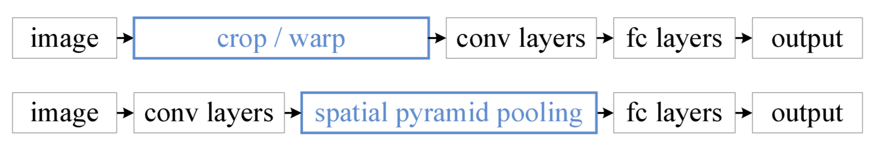
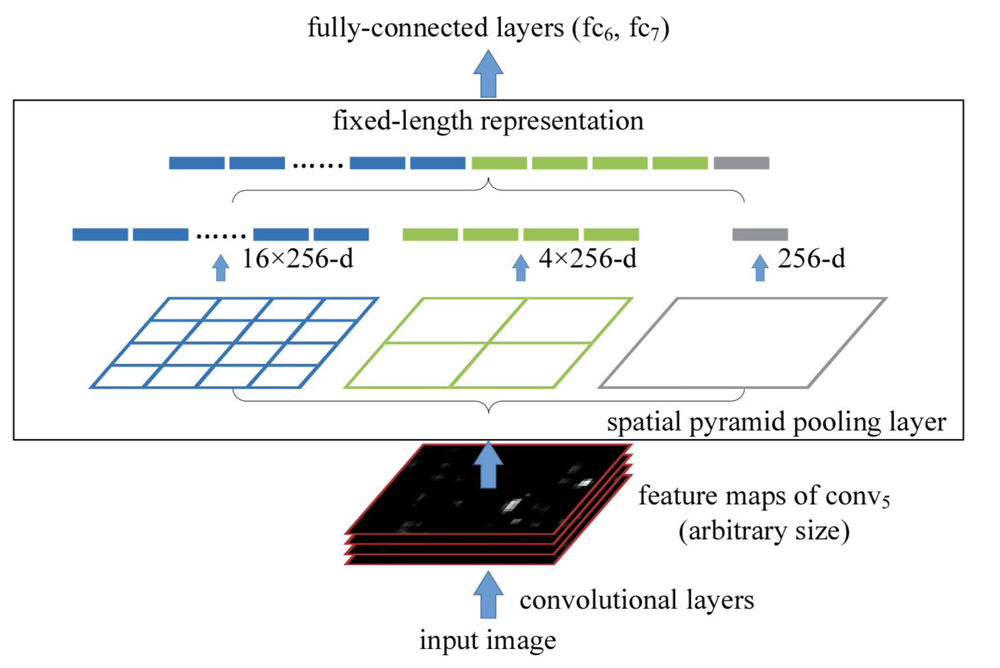

# Paper Name:
**_Spatialpyramidpooling in deep convolutional networks for visual recognition_**
# publishing information
K.He,X.Zhang,S.Ren,andJ.Sun.Spatialpyramidpooling in deep convolutional networks for visual recognition. In ECCV,2014[[paper]](https://arxiv.org/abs/1406.4729)
# 1. background problem/ motivation:
  * the prevalent CNNs methods require a **fixed** input image size(e.g., 224*224), which limits aspect radio and the scale of the input image.
  * current methods mostly fit the input image to the fixed size, either via cropping or warping, which may cause imformation loss.
  * conv layers accept arbitrary input sizes, and produce ouputs of variable sizes. 
  * the classifiers(e.g., SVM /softmax) or fully connected layers required fixed-length vectors.

# 2. the proposed methods:
  * propose a new network structure, called **SPP-net**, can generate a fixed-length representation regradless of image size/scale.
  * propose multi-size training methods
  * propose a simple combination method for detection.

# 3. dataset:
  * ILSVRC classification 2014 8.06%  for top-5
  * ILSVRC detection 2014 31.84%  for mAP
  * VOC 2007

# 4. advantages:
  * Pyramid pooling can generate a fixed-length representation regradlesss of image size/scale, 
  * SPP uses multi-level spatial bins, which shows robust to object deformations.
  * **SPP-net** can **improve all** CNN-based image classification methods.
  * and in object detection, SPP-net compute the feature maps from the entire image only **once**, then pool features in arbitrary regions to generate fixed-length representations for training the detectors.
  * this methods is 24-102x **faster** than R-CNN methods, while achieving better **accuracy**.
  * training with variable-size images increase scale-invariance and reducing over-fitting
  * SPP-net can boost various networks that are deeper and larger than the no-SPP counterparts.

# 5. the detail of methods:
  * SPP-net structure:
	* in order to solve that problem, introduce a spatial pyramid pooling layer between the conv layers and fc layers to remove the fixed-size constraint of the network 
	
	
  * spatial pyramid pooling layer:
	* bin size is fix before the train, use following picture is an example, that is a 3-level spp-layer, which contains three pooling layers and  bins size is (4\*4 + 2\*2+ 1\*1) = 21. the shape of output vector is 1 \* 21 \* 256.
	* pooling filter size is ceil(a/n), stride is floor(a/n), a is the last conv output size, n is the  output window size for every spatial pooling layers.

	

  * experiment on ILSVRC 2012
	* The images are resized so that the smaller dimension is 256, and a 224×224 crop is picked from the center or the four corners from the entire image1. The data are **augmented** by horizontal flipping and color altering. **Dropout** is used on the two fully-connected layers. The learning rate starts from 0.01, and is divided by 10 (twice) when the error plateaus.
	* the SPP-net perform better than its no-spp counterpart is not just because of more parameters, rather, it is because of the multi-level pooling is robust to the variance in object deformation and spatial layout.
	* **multi-level** pooling improves accuracy.
	* **multi-size** training improves accuracy.
	* replace standard 10-view prediction with **full-image representation** improve accuracy and additional two full-image views(with flipping) can still boost accuracy by 0.2%.

	* replace standard 10-view prediction with **multi-view** can reduces the top-5 error from 10.95% to 9.36%. first, resize the image to six scale, s belong to {224,256,300,360,448,560}, use 224\*224 as the view size, use 18 views for each scale: one at the center, four at the corners, and four on the middle of each side, with/without flipping (when s = 224 there are 6 different views). so the number of view is 96.
  * for object detection
	* SPP-net is similiar to R-CNN except add a spatial pooling which can extract the feature maps from the entire image only **once**. 
	* first, use selective search to generate about 2,000 windowns per image, then resize the image such that min(w,h) = s, and extract the feature map from the entire image. 
	* second, use a 4-level spatial pyramid (1\*1,2\*2,3\*3,6\*6, totally 50 bins) to pool the feature, which generates a 12,800-dimension  representation for each windows.
	* the rest is the same as R-CNN.
  * the difference between detection and classification training datasets.
	* the detection training data is merely 1/3 of the classification 
	* the category number of detection is 1/5 of classification 
	* the distribution of object scales are differnt. the dominant object scale in classification is about 0.8 of the image, but in detection is 0.5.
	
  * mapping a window to feature maps.
	* left /top boundary  x' = floor(x/S) + 1
	* right/bottom boundary x' = ceil(s/S) -1 
	* S is the product of all previous strides.
# 6. contribution:
  * rank #2 in object detection and # 3 in image classification in ILSVRC2014
  * the first one that trains a single network with input images of multiple sizes.
  * show that many time-proven techniques/insights in computer vision can still play important roles in deep-networks-based recognition.
  * SPP-Net training process is still a multi-stage training which do not change.

# 7. any questions during the reading :
  * what is spatial pyramid matching?

  * what is standard 10-view prediction
	输入256\*256大小的图片，我们从图片的5个指定的方位(上下左右+中间)进行裁剪出5张224\*224大小的图片，然后水平镜像一下再裁剪5张，这样总共有10张；然后我们把这10张裁剪图片分别送入已经训练好的CNN中，分别预测结果，最后用这10个结果的平均作为最后的输出。

# 8. vocabulary:
deformation 形变
elevate 提升
geometric 几何
compromised 妥协
orthogonal 正交
sophisticated 复杂
manuscript 手稿
facilitate 方便
leveraging 借力
discrete 离散
compelling 引人注目
analogous 类似的
discrete 离散
