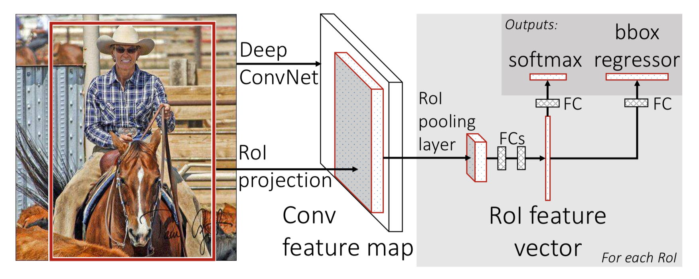

# Paper Name:
**_Fast R-CNN_**

# publishing information
R. Girshick. Fast R-CNN. arXiv:1504.08083, 2015.[[paper]](https://arxiv.org/abs/1504.08083)

# 1. background problem/motivation:
  * current approaches (e.g., R-CNN and SPP-net) train models in multi-stage pipelines that are slow and inelegant
  * detection requires the accurate localization of object, creating two primary challenges.
    * first, numerous candidate object location must be processed.
    * second, these candidates provide only rough localization that must be refined to achieve precise localization.
  * SPP-net and R-CNN train models cost expensive in space and time. features are extracted from each object proposal in each image written to disk, which require hundreds of gigabytes of storage
  * SPP-net can't update the convolutional layers tha precede the spatial pyramid pooling. 
  * SPPnet is unable to update weights below the spatial pyramid pooling layer. the root cause is that back-prop through the spp layer is highly inefficient when each training example comes from different image.

# 2. the proposed methods:
  * overall of the architecture
    
    * input: entire image and a set of object proposals.
    * feature extractor : VGG or AlexNet.
    * RoI pooling laye: convert feature map with a fixed spatial extent of H x W. this RoI layer is simply the special-case of the spatial pyramid pooling layer used in SPPnets in which there is only one pyramid level.
  * propose a more efficient training method that takes advantage of feature sharing.
# 3. dataset:

# 4. advantages:
  * higher detection quality(mAP) than before.
  * training is single-stage, using a multi-task loss.
  * training can update all network layers.
  * no disk storage is required for feature caching.
# 5. the detail of methods:  
  * pre-trained networks
    * last max pooling layer is replaced by a RoI pooling layer
    * the network's last fully connected layer and softmax are replaced with the two sibling output layers: one that produces softmax probability estimates over K object classes plus background class and another layer that outputs four real-valued numbers for each of the K object classes.

  * during training, SGD mini-batches are sampled hierarchically, first by sampling N images and then by sampling R/N RoIs from each image. it wis 64x faster than sampling one RoI from 128 different images(i.e.,the SPPnet and RCNN). and images are horizontally flipped with probability 0.5, no other data augumentation is used.

  * multi-task loss
    * softmax output layer, output a discrete probability distribution  $p = (p_0...p_k)$, over K+1 categories.
    * bounding-box regression offsets, $t^k = (t^k_x,t^k_y,t^k_w,t^k_h) $
  * loss 
    $L(p,u,t^u,v) = L_{cls}(p,u) + \lambda[u\geqslant1]L_{loc}(t^u,v)$
    * $L_{cls} = -log(p_u) $
    * $[u\geqslant1]$ evaluates to 1 when u>=1 and 0 otherwise. when u=0, the object is background.
    * $L_{loc}(t^u,v) = \sum_{i\in\{x,y,w,h\}}smooth_{L1}(t^u_i-v_i)$

    * $smooth_{L1}(x) = \left\{\begin{matrix}
            0.5x^2   &  if |x| <1\\ 
            |x|-0.5  & otherwise 
            \end{matrix}\right.$
  * mini-batch sampling, take 25% as the positive example, it have IoU overlap with a ground-truth bounding box of at least 0.5. the remain RoIs are sampled from object proposals that have a max IoU with ground truth in the interval [0.1~0.5]

  * hyper-parameters
    * FC layers are initialized from N(0,0.001),bias is 0,
    global learning rate is 0.001.
    * momentun of 0.9 and parameter decay of 0.0005 are used.
    

# 6. contribution:
  * propose a new training algorithm that fixes the disadvantage of R-CNN and SPPnet, while improving on their speed and accuracy.

# 7. any questions during the reading :
  * why SPPnet is unable to update weights below the spatial pyramid pooling layer.
  
  * why use N = 2,R = 128 for training.
  * why use $\lambda $ equal to 1
  * why replace L2 lose with smooth function in bounding-box regression.
  

# 8. vocabulary:
streamline 精简
elucidate 阐述
stems from 起源于
span 跨越
agnostic 不可知
permutations 排列