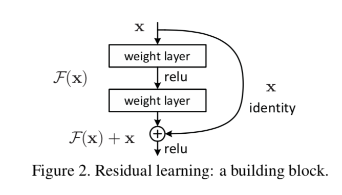

# Paper Name:
**_Deep Residual Learning for Image Recognition_**

# publishing information
K. He, X. Zhang, S. Ren, and J. Sun. Deep residual learning for image recognition. In CVPR, 2016
[[paper]](https://arxiv.org/pdf/1512.03385.pdf)

# 1. background problem:
  * the problem of vanishing/exploding gradients has been largely addressed by normalized initialization and intermediate normalization layers.
  * the degradation problem appears: with the network depth increasing accuracy gets saturated and then degrades rapidly and adding more layers to a suitably deep model leads to higher training error.

# 2. the proposed methods:
  * in order to address problems as mentioned before, introducing a deep residual learning framework, which contains identity mapping shortcut.
  
# 3. dataset:
  * top-5 3.57%  won the 1st place in ILSVRC-2015 classification competition.
  * won the 1st place in ILSVRC-2015 detection and localization competition.
  * COCO detection and COCO segmentation in ILSVRC & COCO2015 competition.

# 4. advantages:
  * alleviate the problem of degradation.
  * residual nets are easy to optimize and can easily enjoy accuracy gains from greatly increased depth, producing results substantially better than previous networks.

# 5. the detail of methods:
  * residual block:

    * base on the hypothesizes that multiple nonlinear layers can asymptotically approximate complicated function.
    * denote the desired underlying mapping as H(x) , F(x) as the residual mapping ,F(x) = H(x) - x, x is the layer input,
    * the shortcut connection are skipping one or more layers and perform identity mapping and their outputs are added to the output of the stacked layers.
    * add a shortcut connection are easier to optimize the residual mapping than to optimize the original
    * 0->H(x) is hard but x->H(x) is easier
    * this is motivated by the counterintuitive phenomena about the degradation problem.
       
    * F+x is performed by a shortcut connection and element-wise addition (normal addition)
    * F is flexible. F at least has two or three layers,while more layers are possible.

  * shortcut connection 
    * GoogleNet connected to auxiliary classifiers for addressing vanishing/exploding gradient
    * inception layer is composed of a shortcut branch and a few deeper branches.
    * concurrent works like highway network, present shortcut connections with gating functions, whichare data-dependent and have parameters.

  * three option for shortcut 
    * A) extra zero entries padded for increasing dimension which introduces no extra parameter
    * B) projection shortcut change the formulation as follow, projection shortcuts are used for increasing dimension, and other shortcuts are identity.
      $$ y = f(x, { W_i}) + W_s*x$$
    * C) all shortcuts are projections.
    * as result, all options are better than plain counterpart, B is slightly better than A. C is marginally better than B.

  * network architectures
    * plain network 
      * for the same output of feature map size, layers have the same number of filter.
      * feature map size is halve, the number of filters is doubled.
      * downsample by convolutional layers that have a stride of 2.
    * The structure of Resnet is the same as plain net except for add shortcuts.
     
    
# 6. contribution:
  * the degradation problem suggests that the solvers may have difficulties in approximating identity mappings by multiple nonlinear layers.

# 7. any questions during the reading :
  * what is degradation problem:
    * with the network depth increaing, accuracy gets saturated and then degrades rapidly.
    * such degradation is not caused by overfitting, and adding more layers to a suitable deep model leads to higher training error.

  * why it is hard to learn a indentity mapping after several layers.

  * what is VLAD?
  
  * section 2 residual representation is hard to understand.

  * what if use $W_s$ in every shortcut?
    * the accuracy would be better, but the time complexity and model size will double.
  
  * why need to warm up when training the 110-layer ResNet using the CIFAR-10 dataset.

# 8. vocabulary:
reformulate 重新定制
explicit 明确地
comprehensive 全面的
empirical 经验
solely 独自
reveal 揭示
obstacle 障碍
notorious 臭名昭著
covergence 收敛
degradation 降解
counterpart 副本
akin 类似的
generic 通用的
image retrieval 图像检索
in contrast 
on the contary of 
asymptotically 渐进
counterintuitive 有悖常理
precondition 前提
perturbations 扰动
negligible 微不足道
philosophy 哲学
plateaus 高原
analogous 类似的
exponentially 成倍
metrics 指标

